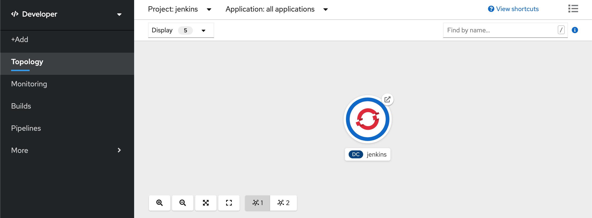

<p align="center"></p>

<h1 align="center">RAPIfi-FlaskWebApp</h1>

_This is the landing page of a fictional Wifi company, RAPIfi. It uses Flask and Bootstrap Web app and has a dockerfile to run it_

## How to use 

* In the main directory run the following commands: 

```bash
$ docker build -t rapifi-flask-nginx .
$ docker run -p 8081:8081 rapifi-flask-nginx
 ```

* You can see the app by entering to "localhost:8081" through a web browser.


## What will I find here?

🍄 When you open the app you'll see the main page with a Contact Form at the end ('/') <br>
🍄 The contact form submits to a csv file for test purposes <br>
🍄 By completing the form you'll be redirected to the same page with a success message ('/form') <br>

🍄 If you want to see the entered values, scroll to the end page and you'll find a link to the "employee login page" <br>
🍄 Complete the form:<br>
```
Username: admin
Password: admin
```
🍄 You'll be redirected to '/datos' 


### Testing

Option 1:
* We can use Gunicorn to see the application running this command:

```bash
$ cd app
$ gunicorn --bind 0.0.0.0:5000 wsgi
```
And enter 0.0.0.0:5000

* Test with "nosetests --with-xunit"


Option 2:
* Create Virtual Env:

```bash
$ pip install virtualenv
$ virtualenv flask
```
* Navigate to "flask" folder and activate

> $ source bin/activate 

* Install Flask

> $ python -m pip install flask

* Check if it was installed

> $ python -m pip list

* Run the application 

```bash
$ cd ..
$ cd app
$ python app.py
```
* Stop the environment

> $ deactivate

### Deploy on Openshift 

1. Navigate to the openshift/pipelines folder and log in into your cluster.
2. Create a new project and add a jenkins instance from template. 

You can find more information about that in the following link: https://developers.redhat.com/blog/2019/05/02/get-started-with-jenkins-ci-cd-in-red-hat-openshift-4/

<br><p align="center"></p><br>

3. Create 2 new Openshift projects:
    DEV_PROJECT = "rapifi-demo"
    STAGE_PROJECT = "rapifi-stage"
   And run the following commands to give access to Jenkins to modify them:

> $ oc policy add-role-to-user edit system:serviceaccount:jenkins:jenkins -n rapifi-demo
> $ oc policy add-role-to-user edit system:serviceaccount:jenkins:jenkins -n rapifi-stage

4. From your terminal run the following command:

note: make sure to change the repository name in both the Jenkinsfile and the yaml beforehand

> $ oc apply -f jenkins-pipeline.yaml

5. From the Jenkins UI you can run the 